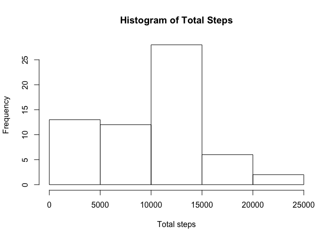
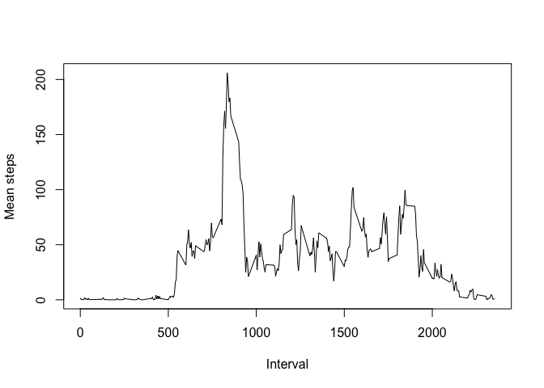
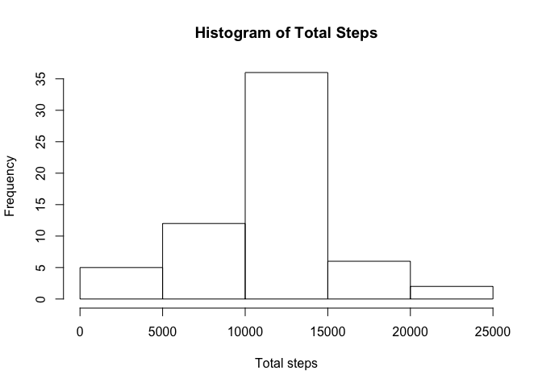
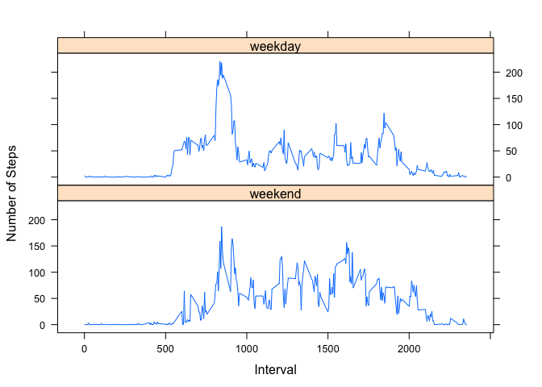

# Reproducible Research: Peer Assessment 1


## Loading and preprocessing the data

First we will load the libraries used to perform the analysis. *dplyr* is used for data manipulation, *mice* for data imputation and *lattice* for the panel plot.


```r
library(dplyr)
library(mice)
library(lattice)
```

Next we download the raw data ready for processing. The fields are typed during this step to support future processing steps.

```r
if (!file.exists("activity.zip")) {
  download.file("https://d396qusza40orc.cloudfront.net/repdata%2Fdata%2Factivity.zip", "activity.zip")
}
activity_ds <- read.csv(unz("activity.zip","activity.csv"), colClasses = c("integer","Date","integer"))
```


## What is mean total number of steps taken per day?

Next we sum steps by date and plot a histogram of the result.

```r
totalstepsbyday <- activity_ds %>% group_by(date) %>% summarise(step_total=sum(steps, na.rm=T))
hist(totalstepsbyday$step_total, xlab = "Total steps", main = "Histogram of Total Steps")
```

<!-- -->

```r
step_total_summary <- summary(totalstepsbyday$step_total)
```
The *mean* for these results is 9354 and the *median* 1.04\times 10^{4}

## What is the average daily activity pattern?
Next we calculate the mean steps by interval and plot the results.

```r
meanstepsbyinterval <- activity_ds %>% group_by(interval) %>% summarise(mean_steps=mean(steps,na.rm=T))
plot(meanstepsbyinterval$interval,meanstepsbyinterval$mean_steps,type="l", xlab = "Interval", ylab="Mean steps")
```

<!-- -->

```r
max_int_mean_steps <- meanstepsbyinterval[which.max(meanstepsbyinterval$mean_steps),]
```
The maximum average number of steps is 206.1698113 which occurred in interval 835.

## Imputing missing values
The number of missing steps values from base dataset is 2304.

We will use the *mice* library to impute the missing values and then plot a histogram of the results.

```r
tempData <- mice(activity_ds,method = 'pmm',seed=500, printFlag = F, pred=quickpred(activity_ds, mincor = 0.0, exclude = c("date")))
imputed_activity_ds <-complete(tempData)
totalstepsbyday <- imputed_activity_ds %>% group_by(date) %>% summarise(step_total=sum(steps, na.rm=T))
hist(totalstepsbyday$step_total, xlab = "Total steps", main = "Histogram of Total Steps")
```

<!-- -->

```r
imp_step_total_summary <- summary(totalstepsbyday$step_total)
```
The *mean* for these results is 1.098\times 10^{4} and the *median* 1.116\times 10^{4}

## Are there differences in activity patterns between weekdays and weekends?

```r
week_days <- c('Monday', 'Tuesday', 'Wednesday', 'Thursday', 'Friday')
imputed_activity_ds$weekpart <- factor((weekdays(imputed_activity_ds$date) %in% week_days), 
         levels=c(FALSE, TRUE), labels=c('weekend', 'weekday'))
weekpart_avg_data <- imputed_activity_ds %>% group_by(interval,weekpart) %>% summarise(avg_steps=mean(steps))
xyplot(avg_steps~interval|weekpart,
        type='l',layout=c(1,2),
        xlab='Interval',ylab='Number of Steps', data=weekpart_avg_data)
```

<!-- -->


It appears that the steps taken are more consistent by interval over the weekend in comparison with the steps taken during the week.
